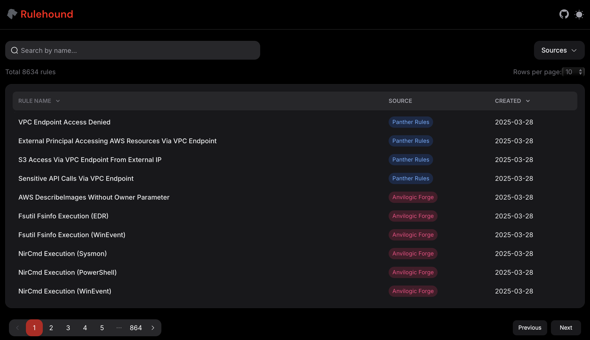

# Rulehound (Coming Soon)
An index of publicly available and open-source threat detection rulesets.

## Preview

## Upcoming Release Info

Rulehound is in the final stages of development and will include the following rulesets at initial release:

- Splunk Security Content Rules
- Elastic Detection Rules
- Panther Rules
- Sigma Rules
- Anvilogic Forge Rules

Please use the issue submission page if you would like your ruleset included in future releases.